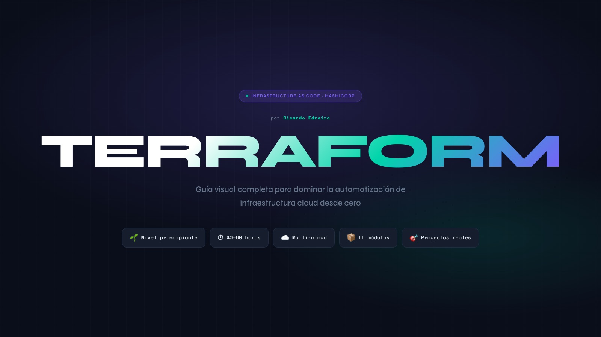

# 🏗️ Terraform · Guía visual desde cero


Guía visual para aprender **Infraestructura como Código con Terraform** desde cero: qué problema resuelve, el flujo de trabajo, HCL, el state, los módulos y las buenas prácticas, con ejemplos reales en AWS y un plan de estudio de 8 semanas.

**[Ver la guía online →](https://ricardoedreirapenas.github.io/Guia_terraform/)**

[](https://ricardoedreirapenas.github.io/Guia_terraform/)

---

## Contenido

| Sección | Qué cubre |
| --- | --- |
| ¿Por qué Infrastructure as Code? | Infraestructura manual frente a IaC; declarativo, multi-cloud, idempotente y modular |
| Flujo de trabajo | `init` → `validate` → `plan` → `apply` → `output` → `destroy`, y los comandos del día a día |
| Fundamentos de HCL | Bloques `terraform`, `provider`, `resource`, `variable`, `output`, `locals`, `data` y `module`, con un `main.tf` completo |
| Terraform State | Cómo se relacionan el código, el state y la nube, y el state remoto en S3 con bloqueo en DynamoDB |
| Módulos reutilizables | Estructura de un módulo, módulos locales y del Registry, y por qué reutilizarlos |
| Construcciones avanzadas | `count`, `for_each`, `depends_on` y `lifecycle` |
| Buenas prácticas | Estructura de archivos, seguridad, versionado, testing y un `.gitignore` para Terraform |
| Plan de estudio | 8 semanas, de instalar Terraform a un proyecto final con VPC, ECS, RDS y ALB, orientado a la certificación **HashiCorp Terraform Associate** |

## Cómo usarla

Es una sola página HTML, sin dependencias ni proceso de build. Para abrirla en local:

```bash
git clone https://github.com/RicardoEdreiraPenas/Guia_terraform.git
open Guia_terraform/index.html
```

## Autor

**Ricardo Edreira Penas** · Data Analyst · Data Engineer Junior
[LinkedIn](https://www.linkedin.com/in/ricardoedreira) · [GitHub](https://github.com/RicardoEdreiraPenas)
